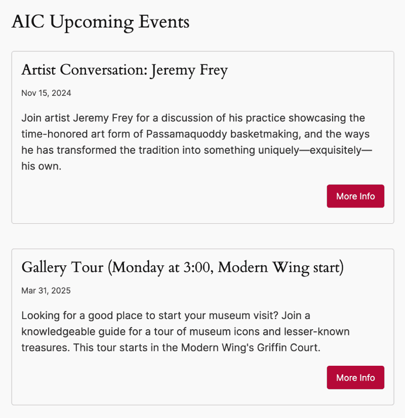

## AIC Upcoming Events
Plugin Name: AIC Upcoming Events Block Plugin
Description: Display the next 5 events from the AIC in a block.
Author: Rafa
Requires at least: 6.6
Requires PHP:      7.2
Version:           0.1.0
Author:            Rafa
License:           GPL-2.0-or-later
License URI:       https://www.gnu.org/licenses/gpl-2.0.html
Text Domain:       aic-upcoming-events

### Description

A simple proof-of-concept Wordpress block that displays the five latest events from the Art Institute of Chicago API.

### Usage

The plugin will create a custom post type named 'PAMM Posts' when activated, and a custom block will be availble in the Wordpress editor named AIC Events Block that can be inserted into any post.

### Installation

1. Download the latest release, extract it, and upload the folder to your Wordpress plugins directory.
1. Activate the plugin through the 'Plugins' screen in WordPress

### Screenshots

